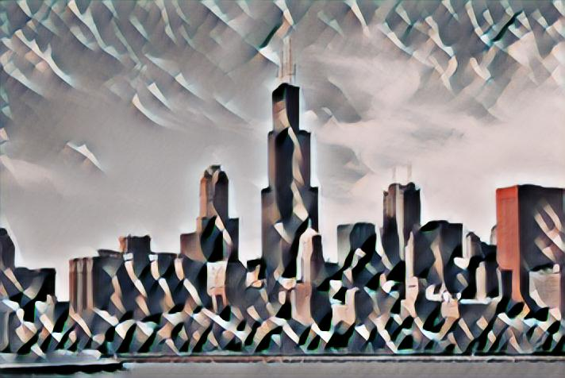
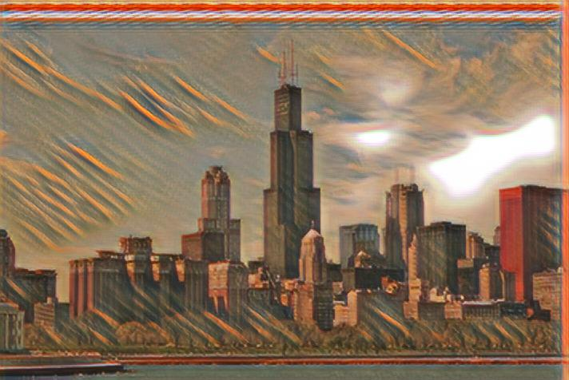
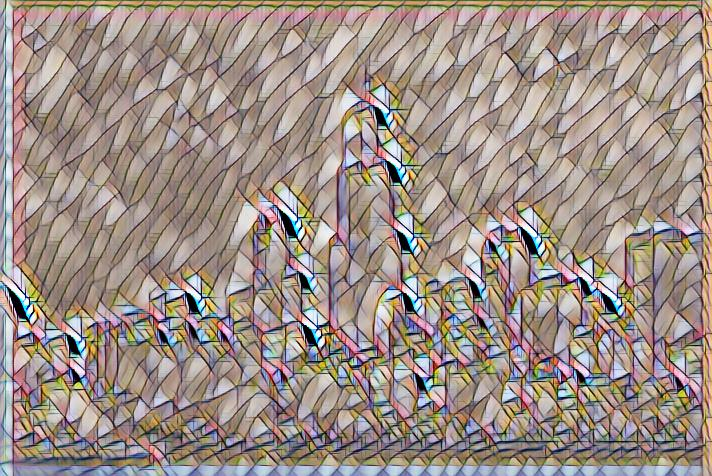

PyTorch implementation of 'perceptual losses for real-time style transfer and super-resolution'

* https://arxiv.org/abs/1603.08155





# Pre-requisite

```
pip install -r requirements
```

# Preparing Training

```
mkdir downloads
cd downloads

wget http://msvocds.blob.core.windows.net/coco2014/train2014.zip
unzip train2014.zip 

rm -rf train2014.zip
```

# Train

train with default parameter

```
python train.py
```

## Available Options
| name                | description | default |
|---------------------|-------------|:-------:|
| --style_image       | reference style image path | samples/style/rain_princess.jpg |
| --batch_size        | size of mini-batch | 4 |
| --lr                | learning rate for SGD | 0.001  |
| --root              | root of training image data | downloads |
| --resume            | weight file path to resume train | None |
| --lambda_content    | weight of content loss | 7.5e0 |
| --lambda_style      | weight of style loss | 1.5e1 |
| --lambda_tv         | weight of total variance loss | 1.5e1 |
| --use_vgg19         | use vgg19 backbone to extract perceptual loss | False |

Note:

Empirically, meaningful result is achieved after 1000 iterations

VGG19 configuration is copied from tensorflow implementation of fast-style-transfer in below respository.
 
 * https://github.com/lengstrom/fast-style-transfer

# Single run

```
python single.py [image file path]
```

## Available Options
| name                | description | default |
|---------------------|-------------|:-------:|
| --weight            | weight file name | checkpoints/style_transfer-latest.pth |
| --outfile           | save result to file | (optional) |
| --width             | output image width | (optional) |
| --height            | output image height | (optional) |
